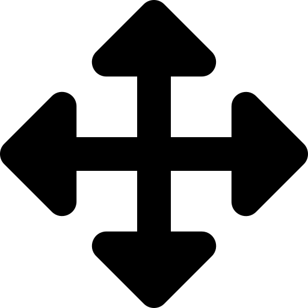

# Image overlay feature

This feature set allows positioning an image overlay on the map.

## Creating an image overlay

Before adding an image to the application the file should be prepared using some kind of image
manipulation software: Remove unnecessary margins and additional content, apply transparency where
appropriate, and so on.

An image overlay can be created by dragging an image file onto the map. The overlay will initially
be displayed at the center of the current view.

If an image overlay is selected multiple additional buttons are added in the bottom-left corner:

* 
  Toggle the transparency of the image.
  Shortcut: <code>T</code>

* 
  Toggle the move mode in order to position the image on the map.
  Shortcut: <code>M</code>

* 
  Toggle the scaling mode to resize the image.
  Shortcut: <code>S</code>

* 
  Toggle the rotation mode.
  Shortcut: <code>R</code>

* 
  Toggle the free distortion mode.
  Shortcut: <code>D</code>

## Exporting the image overlay

The image overlay export consists of two files:

* One PNG file, containing the transformed image using approximately the original resolution.
* One JSON file, containing the configuration metadata for the layer.

Image overlays can be re-imported by dragging both the JSON file and the **original** image file
(not the distorted one generated by the export) onto the map together.

It is possible to make changes to the original file and then import this modified file together
with the JSON config in order to recreate the rotated/distorted image.

## Hints for positioning the image overlay

* Activate the transparency of the layer [T].
* Move the map to approximately the right view before adding the image.
* Rotate the image to the right angle [R].
* Move the image to the right position [M].
* Resize the image [S].
* Apply those three steps multiple times if necessary.
* Move each corner into position by focusing on some detail close to the corner [D].
* Repeat for each corner until the overlay fits.

Use details which have clearly visible borders, like footpaths, tramway tracks, or crosswalks.
Rooftops can also be used, but keep in mind that they won't match features close to the ground,
if the orthophotos were taken from different angles.

Switching between the map and orthophoto base layer may help to position the image correctly.
